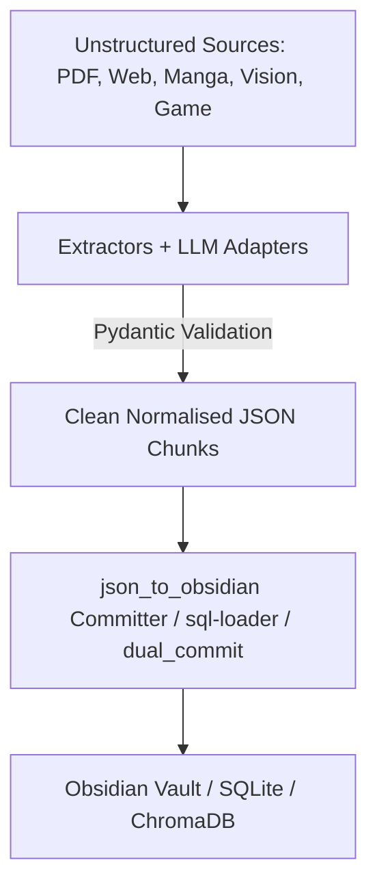
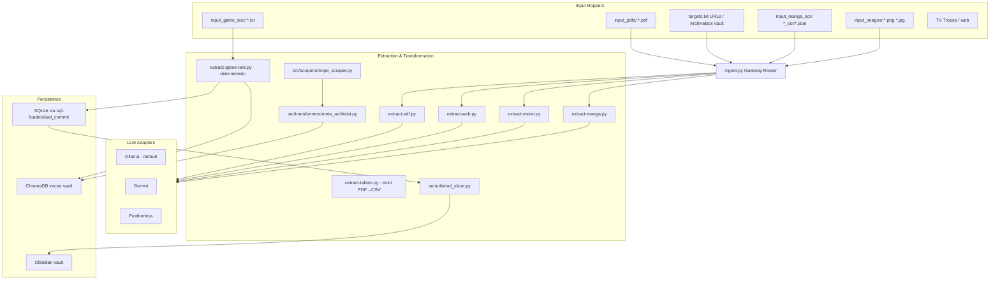

# 🌌 Lore Matrix (V4)

[](https://github.com/EmCargi/lore-matrix/actions/workflows/ci.yml)


**An offline-first, multimodal ETL pipeline, cognitive knowledge graph generator, and deterministic game-dialogue harvester.**

Lore Matrix is a data-engineering portfolio suite: it ingests unstructured sources — PDFs, web pages/ArchiveBox snapshots, RPG text exports, Manga OCR timelines, and images — normalizes them through strict Pydantic schemas, and persists them as relational rows (SQLite), vector embeddings (ChromaDB), and single-note repositories (Obsidian). It is built for **resilience (idempotent, schema-validated, retry-hardened), portability (provider-agnostic LLM adapter, path-agnostic resolution), and decoupling (central config, externalized prompts)**.

> **📌 Project status — complete.** V4 shipped, validated end-to-end on 3 real lorebooks (150+ notes, 0 failures), polished (unified exporter, interactive visualizer, repo hygiene 2026-09-11). Since then: **manga narrative pipeline** (2026-09-14) — EasyOCR + big-rig Stheno synthesis, per-series SQLite + Chroma `manga_vault` dual-commit, a durable HITL correction layer, and an OCR transcript review vault. **117 tests green**, `ruff` clean. Details: [HANDOFF-lore-matrix.md](HANDOFF-lore-matrix.md).

### ⚡ At a Glance

| Property | Detail |
| :--- | :--- |
| **Ingest** | PDF · web / ArchiveBox · Manga OCR · images · RPG game text · TV Tropes |
| **Validation** | Strict Pydantic v2 schemas · reasoning-tag & code-fence cleaning |
| **Persist** | SQLite (relational + per-series manga discs) · ChromaDB (vector) · Obsidian (notes) |
| **Resilience** | Idempotent writes · tenacity retries · provider-agnostic LLM adapter · deterministic parsers |
| **Quality** | `ruff` lint + `pytest` suite gated in CI (Python 3.11 / 3.12) |



---

## 🛠️ Systems Architecture

The pipeline follows a modular, decoupled ETL pattern — every stage is a standalone CLI script orchestrated from a master menu (`lore-matrix.py`), so each subsystem can run, test, and scale independently.



> **Note:** every box is a runnable script; the menu is a thin orchestrator that spawns them as subprocesses.

---

## 📦 What's in V4

V4 consolidates the suite and makes it GitHub-ready as a portfolio artifact:

1. **Packaging & continuous integration** — `pyproject.toml` (dynamic deps, lint/test config), MIT license, and a GitHub Actions workflow (`ruff` lint + `pytest`) on Python 3.11 / 3.12.
2. **One general-purpose SQL loader** — the two overlapping CSV→SQLite tools were merged into `sql-loader.py`: a non-destructive `--if-exists fail|replace|append` default and an optional `--key` idempotent UPSERT (`ON CONFLICT DO UPDATE`) with an enforced unique index. The domain-specific POC was retired.
3. **Reasoning-output correctness** — every extractor now strips model `thinking` tags via `core.utils.clean_reasoning_response()` before Pydantic validation, fixing JSON-in-`response` validation crashes.
4. **Uniform serialization** — all producers emit canonical aliased keys (`by_alias=True`), with a backward-compatible fallback in the Obsidian compiler.
5. **Non-destructive defaults** — the PDF extractor archives only when chunks are actually saved; destructive-db strategy defaults to `fail`; every critical `except` path is annotated with intent.

> The design history of the loader merge is captured in the repo `CHANGELOG.md`.

### Recent additions (4.1.0)

6. **Unified Obsidian exporter** — 3 overlapping exporters consolidated into one with `--phase raw` / `--phase compile` / one-shot. Pure `core/raw_vault_builder.py` (zero LLM imports), legacy `json-to-md.py` + `md-to-obsidian.py` deleted. Also fixed a silent alias-drop bug in `map_sillytavern_entry`.
7. **Interactive visualizer** — `--chart-type interactive` adds matplotlib Slider + Button (manual frame scrub, fading trail, auto-play, arrow-key stepping). Headless backends fall back to GIF export. `--output` respects absolute/relative paths (bare filenames resolve to `processed_data/`).
8. **Pipeline validation** — tested end-to-end on 3 real SillyTavern lorebooks (JJK, 1850's Slang, Cyberpunk 2077 — 150+ notes, 0 failures). Fixed subfolder naming (`General_Rules` → `Converted JSON`), YAML validator rejection (quoted arrays), and `.title()` acronym mangling.
9. **GUI rendering** — PyQt5 installed for `Qt5Agg` backend support on desktop environments.
10. **Subfolder differentiation deferred** — source JSON entries carry no `type`/`category` metadata, so `Converted JSON` is the correct default. Human-in-the-loop review of raw notes before compiling is a feature, not a limitation.

> The design history of these additions is captured in the repo `CHANGELOG.md`.

### Recent additions (4.2.0)

11. **Manga narrative pipeline** — comic pages → `extract-vision.py --series <name>`
    (EasyOCR local + big-rig L3-8B-Stheno synthesis) → per-series SQLite disc
    (`manga-data/<series_id>/data/<series_id>.db`, PK `(series_id, page,
    entry_index)`) + Chroma `manga_vault` dual-commit (nomic-embed-text) via
    `manga_db_loader.py`. Consumed downstream by the persona-etl card factory
    (`manga:<series_id>[:<speaker>]` intake).
12. **HITL correction layer** — `manga_db_edit.py` (list/edit/delete/apply/
    corrections): durable `corrections` overrides (NULL = leave untouched) +
    tombstone deletes, auto-applied after every load and re-synced to Chroma —
    the human fix point before OCR noise propagates to downstream cards.
13. **OCR transcript review vault** — `--ocr-vault --ocr-only` writes the raw
    EasyOCR transcript per page (`output/json_staging/ocr_transcript/…`), a
    no-LLM "inspect raw, then compile" review surface for humans.
14. **Browser uploaders** — Streamlit Ingest tab gains JSON / PDF / image
    uploaders + a vision reading-direction toggle (LTR/RTL).

> The design history of these additions is captured in the repo `CHANGELOG.md`.

---

## 🚀 Installation & Setup

```bash
python3 -m venv venv
source venv/bin/activate
pip install -r requirements.txt
# optional but recommended, run from repo root:
ruff check .
python -m pytest
```

### External Dependencies
- **Ollama** — local reasoning models (`deepseek-r1:7b`, `qwen2.5-coder`), the default `local` provider. Big-rig L3-8B-Stheno recommended for narrative synthesis.
- **EasyOCR** — vision engine for the multimodal harvester (installed on the thin client).
- **ChromaDB** — vector store for trope-RAG, dual-commit, and the `manga_vault` collection (embeddings via `nomic-embed-text` on Ollama).

### Configuration (`config/settings.py`)
Everything central lives in one place — engines, prompt paths, and the pipeline's directory layout. Key settings:

| Setting | Purpose |
| :--- | :--- |
| `DEFAULT_ENGINE` | Provider engine: `local` · `gemini` · `featherless` |
| `ACTIVE_VISION_MODEL` | Default local model name (`deepseek-r1:7b`) |
| `IS_REASONING_MODEL` / `REASONING_TAG_NAME` | Auto-strip model `thinking` blocks before validation |
| `OUTPUT_CHUNKS_DIR` | Central JSON staging dir (`output/json_staging`) |
| `ARCHIVEBOX_VAULT_DIR` | Local ArchiveBox snapshot root for offline web ingest (env-overridable) |
| `EXTRACTOR_SYSTEM_PROMPT` | Loaded from `config/extractor-prompt.md` |

### LLM Providers (`core/engines.py`)
A uniform factory exposing `generate(system_prompt, user_content, response_format=None)` over three interchangeable backends, all enforcing Pydantic structured output:
- **`LocalProvider`** — Ollama (default).
- **`GeminiProvider`** — Google Gemini.
- **`FeatherlessProvider`** — OpenAI-compatible.

---

## 🧭 Interactive CLI (`lore-matrix.py`)

```bash
./venv/bin/python lore-matrix.py
```

| Option | Action |
| :--- | :--- |
| 1 | Run **Unified Ingestor** (`ingest.py`) |
| 2 | Compile JSON → Obsidian notes (`json_to_obsidian.py`) |
| 3 | **Data Visualizer** wizard |
| 4 | **SQL Data Loader** wizard (`sql-loader.py`) |
| 5 | Extract Data Tables — strict PDF→CSV (`extract-tables.py`) |
| 6 | Profile & Sanitize raw datasets (`data-profile.py`) |
| 7 | Database Backup & Rollback manager (`db-migrate.py`) |
| 8 | Export SQLite queries → Obsidian Markdown (`sql-to-md.py`) |
| 9 | Harvest narrative tropes (`trope_scraper.py`) |
| 10 | Vault & Query Tropes submenu (`vector_vault.py`) |
| 11 | **Advanced: Run Individual Ingestors** submenu |
| 12 | Ingest a frozen ArchiveBox asset (by Timestamp ID) |
| 13 | Slice a monolithic Markdown file (`md_slicer.py`) |
| 14 | Exit |

> Run any script standalone too — e.g. `./venv/bin/python sql-loader.py --input data.csv --db library.db --table characters --key id`.

---

## 🗺️ Module Cross-Reference

### Root scripts
| Script | Role |
| :--- | :--- |
| `lore-matrix.py` | Master CLI menu (orchestrator) |
| `ingest.py` | Unified gateway router for the main harvesters |
| `extract-pdf.py` · `extract-web.py` · `extract-vision.py` · `extract-manga.py` | Multimodal harvesters (PDF / web+ArchiveBox / images / manga OCR) |
| `extract-game-text.py` | Deterministic RPG dialogue parser |
| `extract-tables.py` | Strict PDF→CSV table extractor |
| `sql-loader.py` | Generic CSV/XLSX → SQLite loader (strategy-driven) |
| `sql-to-md.py` | SQLite → Obsidian Markdown exporter |
| `data-profile.py` | Dataset health audit / sanitization gate |
| `db-migrate.py` | SQLite snapshot & rollback manager |
| `json-to-lorebook.py` · `import-json.py` | SillyTavern lorebook compilers & importers |
| `manga_db_loader.py` · `manga_db_edit.py` | Per-series manga narrative DB (SQLite + Chroma dual-commit) · HITL correction CLI |
| `src/transformers/json_to_obsidian.py` | Unified Obsidian exporter — `--phase raw` (no-LLM JSON→raw), `--phase compile` (raw→compiled), or one-shot |

### `core/`, `src/`
| Path | Role |
| :--- | :--- |
| `core/engines.py` | Provider abstraction (local / gemini / featherless) |
| `core/utils.py` | Reasoning-tag stripper + `info()/error()` & Pydantic schemas |
| `core/image_processing.py` | OCR enhancement (CLAHE, deskew, binarize) |
| `core/visualize-data.py` | Data visualizer engine (bar/line/box/scatter3d/animate3d/interactive/network + MIDI JSON) — interactive adds Slider + Button + trail + arrow-key stepping |
| `src/scrapers/trope_scraper.py` | TV Tropes harvester |
| `src/transformers/meta_archivist.py` · `json_to_obsidian.py` | Trope ETL & Obsidian compiler |
| `src/storage/dual_commit.py` | Game dialogue → SQLite + ChromaDB dual-commit |
| `src/storage/vector_vault.py` | ChromaDB trope vault & query |
| `src/utils/md_slicer.py` | Monolithic MD → frontmatter-inheriting card slicer |

---

## 🧪 Testing & CI

The `pytest` suite (`testpaths = tests`) covers the deterministic subsystems:

```bash
venv/bin/ruff check .   # lint
venv/bin/python -m pytest   # tests
```

A GitHub Actions workflow (`.github/workflows/ci.yml`) runs **ruff lint** and **pytest** on every push/PR against Python 3.11 and 3.12.

---

## 🧂 Quality Philosophy

- **Idempotency everywhere**: hash caches, `ON CONFLICT DO UPDATE` upserts, unique-constraint migrations, atomic writes (`tempfile` + `os.replace`).
- **Never destroy data** — merge into the source vaults are forbidden; artifacts are regenerable; destructive ops are snapshot-backed.
- **Humans and machines both** — rich console feedback for operators, and structured Pydantic models for downstream tools.

---

## 🧭 Quick routes

| Task | First opens |
|---|---|
| Run the menu | [lore-matrix.py](lore-matrix.py) (15 options, subprocess orchestrator) |
| Sweep all hoppers | [ingest.py](ingest.py) (auto-detects input type, routes to extractor) |
| One extractor standalone | [extract-pdf.py](extract-pdf.py) / [extract-web.py](extract-web.py) / [extract-game-text.py](extract-game-text.py) / [extract-narrative.py](extract-narrative.py) / [extract-ocean.py](extract-ocean.py) / [extract-head.py](extract-head.py) |
| Browser dashboard | `streamlit run` [browser_lore_matrix.py](browser_lore_matrix.py) |
| Manga: extract → load → correct | [extract-vision.py](extract-vision.py) `--series <name>` → [manga_db_loader.py](manga_db_loader.py) → [manga_db_edit.py](manga_db_edit.py) `list/edit/apply` |
| JSON → Obsidian | [src/transformers/json_to_obsidian.py](src/transformers/json_to_obsidian.py) `--phase raw` (no-LLM) / `compile` / one-shot |
| Visualize | [core/visualize-data.py](core/visualize-data.py) (bar/line/box/scatter3d/animate3d/interactive/network + MIDI JSON) |
| Load CSV → SQLite | [sql-loader.py](sql-loader.py) (idempotent upsert) |
| Config / providers | [config/settings.py](config/settings.py), [core/engines.py](core/engines.py) |
| Current state | [HANDOFF-lore-matrix.md](HANDOFF-lore-matrix.md) |

---

## 📄 License

[MIT](LICENSE)
